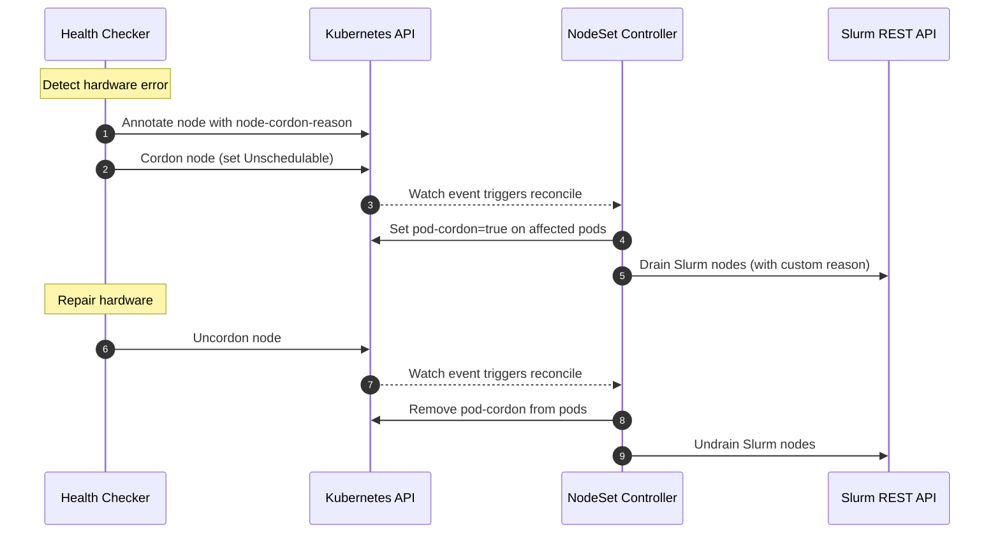

# NodeSet Operations

This guide documents how external tools — health checkers, custom automation,
monitoring systems — can interact with NodeSets using Kubernetes-native
primitives. For design-level details, see
[NodeSet Controller](../concepts/nodeset-controller.md).

## Table of Contents

<!-- mdformat-toc start --slug=github --no-anchors --maxlevel=6 --minlevel=1 -->

- [NodeSet Operations](#nodeset-operations)
  - [Table of Contents](#table-of-contents)
  - [Querying Slurm State from Kubernetes](#querying-slurm-state-from-kubernetes)
  - [Cordoning Pods](#cordoning-pods)
  - [Custom Drain Reasons via Node Annotations](#custom-drain-reasons-via-node-annotations)
  - [Influencing Scale-in Order](#influencing-scale-in-order)
    - [Pod Deletion Cost](#pod-deletion-cost)
    - [Pod Deadline](#pod-deadline)
  - [Workload Disruption Protection](#workload-disruption-protection)
  - [External Drain Preservation](#external-drain-preservation)
  - [External Health Checker Integration Pattern](#external-health-checker-integration-pattern)

<!-- mdformat-toc end -->

## Querying Slurm State from Kubernetes

The operator projects Slurm node states onto pod conditions with the prefix
`SlurmNodeState`. You can query these without direct access to the Slurm REST
API.

Check if a Slurm node is drained:

```sh
kubectl get pod <pod> -o jsonpath='{.status.conditions[?(@.type=="SlurmNodeStateDrain")]}'
```

Get the drain reason:

```sh
kubectl get pod <pod> -o jsonpath='{.status.conditions[?(@.type=="SlurmNodeStateDrain")].message}'
```

Check if a Slurm node is idle:

```sh
kubectl get pod <pod> -o jsonpath='{.status.conditions[?(@.type=="SlurmNodeStateIdle")].status}'
```

To determine if a node is **busy** (running work), check whether any of the
`Allocated`, `Mixed`, or `Completing` conditions are `True`:

```sh
kubectl get pod <pod> -o jsonpath='{range .status.conditions[?(@.status=="True")]}{.type}{"\n"}{end}' \
  | grep -E 'SlurmNodeState(Allocated|Mixed|Completing)'
```

A node is **drained** when `SlurmNodeStateDrain` is `True`,
`SlurmNodeStateUndrain` is not `True`, and the node is not busy. A node is
**draining** when those same drain conditions hold but the node is still busy.

## Cordoning Pods

To trigger a Slurm drain from the Kubernetes side, set the `pod-cordon`
annotation on a NodeSet pod:

```sh
kubectl annotate pod <pod> nodeset.slinky.slurm.net/pod-cordon=true
```

The operator will detect this annotation and drain the corresponding Slurm node.
To verify the drain took effect:

```sh
kubectl get pod <pod> -o jsonpath='{.status.conditions[?(@.type=="SlurmNodeStateDrain")].status}'
```

To reverse the drain, remove the annotation:

```sh
kubectl annotate pod <pod> nodeset.slinky.slurm.net/pod-cordon-
```

The operator will undrain the Slurm node, provided the Kubernetes node is not
cordoned and the drain reason was set by the operator.

## Custom Drain Reasons via Node Annotations

When a Kubernetes node is cordoned, the operator drains all NodeSet pods on that
node. By default, the drain reason is auto-generated. To provide a custom reason
that propagates to Slurm, set the `node-cordon-reason` annotation on the
Kubernetes node **before** cordoning it:

```sh
kubectl annotate node <node> nodeset.slinky.slurm.net/node-cordon-reason="GPU ECC error detected"
kubectl cordon <node>
```

The operator reads the annotation and uses its value as the Slurm drain reason,
prefixed with `slurm-operator:`. The resulting reason in Slurm will be:

```
slurm-operator: GPU ECC error detected
```

To clean up after uncordoning:

```sh
kubectl uncordon <node>
kubectl annotate node <node> nodeset.slinky.slurm.net/node-cordon-reason-
```

## Influencing Scale-in Order

When a NodeSet scales in, pods are sorted to determine which ones are deleted
first. The full sort order (first match wins):

1. Unassigned pods before assigned pods
1. `Pending` phase before `Unknown` before `Running`
1. Not-ready pods before ready pods
1. Lower `pod-deletion-cost` before higher
1. Earlier `pod-deadline` before later
1. Cordoned pods before uncordoned pods
1. Higher ordinal before lower ordinal
1. More recently ready before longer-ready
1. More recently created before older

The following are the annotations are honored on a best-effort basis and do not
guarantee deletion order.

### Pod Deletion Cost

Using the `nodeset.slinky.slurm.net/pod-deletion-cost` annotation, users can set
a preference regarding which pods to remove first when downscaling a NodeSet.

The annotation should be set on the pod, the range is [-2147483648, 2147483647].
It represents the cost of deleting a pod compared to other pods belonging to the
same NodeSet. Pods with **lower** deletion cost are preferred to be deleted
before pods with higher deletion cost.

The implicit value for this annotation for pods that don't set it is 0; negative
values are permitted. Invalid values will be rejected by the API server.

```sh
# Protect this pod from early deletion
kubectl annotate pod <pod> nodeset.slinky.slurm.net/pod-deletion-cost=1000

# Mark this pod as expendable
kubectl annotate pod <pod> nodeset.slinky.slurm.net/pod-deletion-cost=-100
```

The implicit cost for pods without this annotation is `0`. Negative values are
permitted.

### Pod Deadline

The `nodeset.slinky.slurm.net/pod-deadline` is an RFC 3339 timestamp. The
operator updates this annotation based on the pod's running Slurm workload. Pods
with **earlier** deadlines are preferred to be deleted before pods with
**later** deadlines.

## Workload Disruption Protection

When `spec.workloadDisruptionProtection` is enabled on a NodeSet, the operator
dynamically labels busy pods with `nodeset.slinky.slurm.net/pod-protect`. A
PodDisruptionBudget (PDB) matches this label to prevent Kubernetes from evicting
pods that are actively running Slurm work.

A pod is considered **busy** when any of the following Slurm states are `True`:
`Allocated`, `Mixed`, or `Completing`.

When a busy pod's Slurm workload completes and the node returns to an idle
state, the operator removes the `pod-protect` label, allowing normal eviction.

To check if a specific pod is currently protected:

```sh
kubectl get pod <pod> -o jsonpath='{.metadata.labels.nodeset\.slinky\.slurm\.net/pod-protect}'
```

## External Drain Preservation

The operator prefixes all drain reasons it sets with `slurm-operator:`. When the
operator encounters a Slurm node whose drain reason does **not** have this
prefix, it treats the reason as externally owned and takes no action:

- The operator will **not** overwrite or clear the external drain.
- The operator will **not** uncordon pods whose Slurm nodes have external drain
  reasons.
- The external drain persists until the external tool or administrator clears it
  directly in Slurm.

This means that drains set via `scontrol` or other Slurm management tools are
preserved across operator reconciliation cycles.

## External Health Checker Integration Pattern

External health checkers can integrate with NodeSets using Kubernetes node
annotations and cordon/uncordon operations. The operator handles the Slurm-side
drain lifecycle automatically.

The end-to-end flow for a hardware error detection and recovery cycle:



See
[Custom Drain Reasons via Node Annotations](#custom-drain-reasons-via-node-annotations)
and [Cordoning Pods](#cordoning-pods) for the kubectl commands used in each
step.
